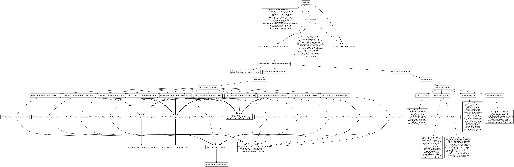

# Dependency Analysis

In order to perform a dependency analysis of the project, you will need to meet an extra requirement of:

* [GraphViz Dot Compiler](https://www.graphviz.org/)

Once the dependency is satisified, you can execute the following commands to create a depedency graph:

    bazel query 'deps(//pkg:rhdfs)' --output graph > graph.in

    dot -Tpng < graph.in > graph.png
    
## Depdendency Graph

    
## Author(s)

Stewart Henderson <stewart.henderson@protonmail.com>